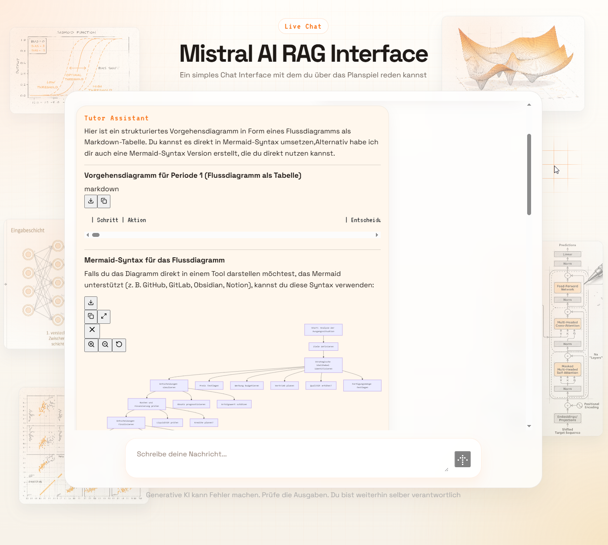

# RAG System TOPSIM

<p align="center">
  
</p>

Ein RAG-basiertes Chat-System fuer das TOPSIM-Planspiel mit React-Frontend und FastAPI-Backend.  
Das Backend nutzt die Mistral Chat Completions API, festen Handbuch-Kontext und Tool Calling (Wetter + ML-Inferenz).

## 💬 Nutzung im Chat (Beispiele)

Du kannst im Chat direkt natuerlich formulieren. Hier sind typische Eingaben als Message-Boxen:

```bash
# Zeit bis zur Abgabe / Periodenfenster
Wie viel Zeit habe ich noch bis zur Abgabe?
```

```bash
# Potenziellen Absatz schaetzen (P1)
Gebe mir eine Einschaetzung ueber den potenziellen Absatz, den ich mit Preis 146, Werbung 342 und 8 Vertriebsmitarbeitern erreichen kann.
```

```bash
# Erfolgswert schaetzen (P1)
Gehe die Zahlen einmal durch und schaetze den Erfolgswert fuer Preis 146, Werbung 342, Vertrieb 8, Qualitaet 0, Fertigungsmenge 40000, Investition 0, Fertigungspersonal 23 und angenommenen Absatz 41000.
```

Hinweis:
- Fuer praezise Prognosen helfen konkrete Zahlen je Eingabefeld.
- Ohne konkrete Werte fragt der Assistent nach oder antwortet qualitativ.
## 🚀 Features

- React Chat-Frontend mit Streaming-Ausgabe (WebSocket)
- FastAPI Backend (`/api/chat`, `/api/health`, `/ws/chat`)
- Tool Calling mit Mistral (`tool_choice=auto`)
- Zwei ML-Vorhersage-Tools (Periode 1) ueber `joblib`-Modelle
- Wetter-Tool via Open-Meteo API
- Langfuse Observability via `@observe`-Dekoratoren (HTTP, WebSocket, Tool-Loop, Tools)
- Dynamisches Kontext-Engineering im Systemkontext:
  - aktuelle Uhrzeit/Tag (interne Systemzeit)
  - aktuelle Periode anhand `settings.py` (`start_date`, `end_date`, `end_uhrzeit`)
- Fester Handbuch-Kontext aus `knowledge_base/Handbuch_erweitert.md`

## 🧱 Architektur

```text
React/Vite UI
   -> FastAPI Backend (main.py)
      -> Mistral Chat Completions API
      -> Tool Layer (mistral_tools.py)
         -> Wetter API (Open-Meteo)
         -> ML Inferenz (joblib: Absatz/Erfolgswert)
      -> Handbuch-Kontext (knowledge_base/*.md)
```

## 📁 Projektstruktur

```text
.
|- frontend/
|- knowledge_base/
|- ML_models/
|  |- Potenzieller_Absatz_p1.joblib
|  |- Erfolgswert_p1.joblib
|- main.py
|- mistral_tools.py
|- settings.py
|- requirements.txt
|- .env.example
|- example.env
```

## 🛠️ Tool Calling

In `mistral_tools.py` sind aktuell folgende Tools registriert:

1. `weather_info`
2. `predict_potentieller_absatz_p1`
3. `predict_erfolgswert_p1`

Die Tools werden im Mistral-Request als `tools` mitgegeben.  
Die Orchestrierung (Tool Calls erkennen, Tool ausfuehren, `role="tool"` zurueckgeben, Folgerunde starten) passiert in `main.py` in `_run_mistral_with_tools(...)`.

## 🤖 ML-Tools (P1)

### 1) Potenzieller Absatz

Tool: `predict_potentieller_absatz_p1`

Eingaben:
- `preis`
- `werbung`
- `vertrieb`
- `qualitaet`
- optional: `fertigungspersonal` (Default 23)
- optional: `investition` (Default 0)

Ausgaben:
- Prognose potenzieller Absatz
- geschaetzter tatsaechlicher Absatz (kapazitaetsbegrenzt)
- geschaetzter Umsatz
- Zusatzinfo: aktueller Lagerbestand liegt bei 1000
- zusaetzliche beschreibende Textfelder (`*_text`)

Modell:
- `ML_models/Potenzieller_Absatz_p1.joblib`

### 2) Erfolgswert

Tool: `predict_erfolgswert_p1`

Eingaben:
- `preis`
- `werbung`
- `vertrieb`
- `qualitaet`
- `fertigungsmenge`
- `investition`
- `fertigungspersonal`
- `angenommener_absatz`

Ausgabe:
- Prognose Erfolgswert (Periode 1)

Modell:
- `ML_models/Erfolgswert_p1.joblib`

> [!CAUTION]
> Die Periodendaten koennen nicht live abgerufen werden.
> Es geschieht keine Datenbankabfrage der aktuellen Unternehmenskennzahlen.
> Die Periodenlogik basiert ausschliesslich auf den statischen Werten in `settings.py` (`PERIOD_DATE_RANGES`).


## Voraussetzungen

- Python 3.10+
- Node.js 18+
- Gueltiger Mistral API Key

## 🔧 Installation

### Backend

```powershell
python -m venv .venv
.venv\Scripts\activate
pip install -r requirements.txt
Copy-Item .env.example .env
```

### Frontend

```powershell
cd frontend
npm install
```

## ⚙️ Konfiguration (`.env`)

Relevante Variablen:

```env
MISTRAL_API_KEY=...
MISTRAL_MODEL=mistral-large-latest
HANDBUCH_PATH=knowledge_base/Handbuch_erweitert.md
WEATHER_LAT=...
WEATHER_LON=...
WEATHER_LOCATION_LABEL=...
UVICORN_HOST=127.0.0.1
UVICORN_PORT=8004
UVICORN_RELOAD=true
UVICORN_LOG_LEVEL=info
APP_LOG_LEVEL=INFO
LANGFUSE_PUBLIC_KEY=pk-lf-...
LANGFUSE_SECRET_KEY=sk-lf-...
LANGFUSE_BASE_URL=https://cloud.langfuse.com
LANGFUSE_TRACING_ENVIRONMENT=production
MISTRAL_MAX_RETRIES=4
MISTRAL_RETRY_BASE_DELAY_SECONDS=1.5
MISTRAL_INPUT_COST_PER_MILLION_EUR=0.5
MISTRAL_OUTPUT_COST_PER_MILLION_EUR=1.5
EUR_TO_USD_RATE=1.08
```
Hinweis: Langfuse aggregiert `cost_details` in USD. Bei EUR-Preisen wird daher per `EUR_TO_USD_RATE` nach USD umgerechnet.

Hinweis: Die Zeit-/Periodenlogik wird ueber `settings.py` gesteuert, nicht ueber `.env`.
Wenn `LANGFUSE_PUBLIC_KEY` und `LANGFUSE_SECRET_KEY` gesetzt sind, ist Tracing aktiv.
Der Health-Endpoint zeigt den Status als `langfuse_enabled` und `langfuse_auth_ok`.

## Anwendung starten

### Backend

```powershell
.venv\Scripts\activate
python main.py
```

oder:

```powershell
uvicorn main:app --reload --port 8004
```

### Frontend

```powershell
cd frontend
npm run dev
```

## Ports und lokale Entwicklung

- Frontend: `http://localhost:5173`
- Backend-Default in `main.py`: Port `8004`
- `frontend/src/App.jsx` nutzt lokal fuer WebSocket aktuell `:9001`
- Alternativ kann der WebSocket per `VITE_WS_URL` explizit gesetzt werden

Wichtig:
- In `frontend/vite.config.js` zeigt der `/api` Proxy aktuell auf `http://localhost:9000`.
- Wenn du `/api` lokal nutzen willst, passe entweder den Backend-Port oder den Proxy an.

## API Endpunkte

- `GET /api/health`
- `POST /api/chat`
- `POST /api/feedback`
- `WS /ws/chat`

`POST /api/chat` liefert:
- `message`
- `trace_id`
- `user_id`
- `session_id`

User/Session-Tracking:
- `x-user-id` und `x-session-id` werden bevorzugt aus Headern gelesen.
- Alternativ werden `user_id` und `session_id` aus Query-Parametern gelesen.
- Wenn keine Werte vorhanden sind, erzeugt das Backend Fallback-Werte.
- `POST /api/chat` liefert `trace_id`, `user_id`, `session_id` in der Antwort.
- `WS /ws/chat` liefert bei `type=done` ebenfalls `trace_id`, `user_id`, `session_id`.

`/api/feedback` ermoeglicht das Speichern von Scores in Langfuse (z. B. User-Feedback):

```json
{
  "trace_id": "your-trace-id",
  "score_name": "user_feedback",
  "value": 1.0,
  "comment": "Hilfreich"
}
```

## Langfuse in Production

Aktuelles Setup:
- Zugriff auf Langfuse ausschliesslich ueber `https://llmroute.de/langfuse/` (HTTPS/443)
- Reverse Proxy ueber Nginx auf den internen Langfuse-Webcontainer
- Kein direkter externer Zugriff auf Port `3000`

Backend `.env.production` (Tracking-Client):

```env
LANGFUSE_PUBLIC_KEY=pk-lf-...
LANGFUSE_SECRET_KEY=sk-lf-...
LANGFUSE_BASE_URL=https://llmroute.de/langfuse
LANGFUSE_TRACING_ENVIRONMENT=production
MISTRAL_INPUT_COST_PER_MILLION_EUR=0.5
MISTRAL_OUTPUT_COST_PER_MILLION_EUR=1.5
EUR_TO_USD_RATE=1.08
```

## 📄 Lizenz

MIT, siehe [LICENSE](LICENSE).
