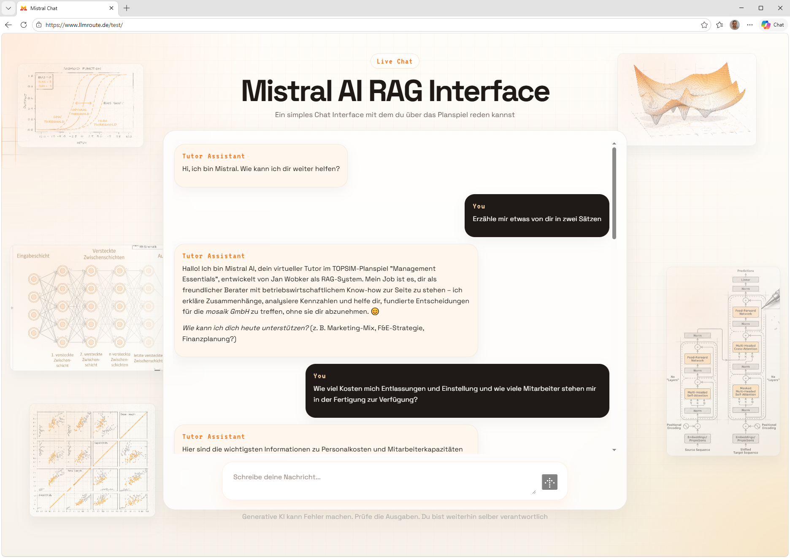
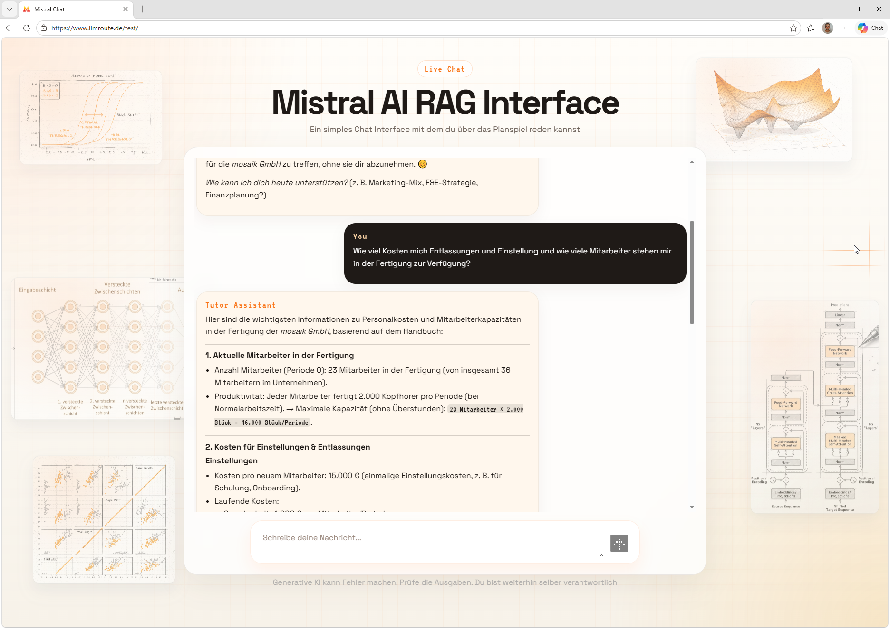

# RAG System TOPSIM

<p align="center">
  
  
</p>

Ein RAG-basiertes Chat-System fuer das TOPSIM-Planspiel mit React-Frontend und FastAPI-Backend.
Das Backend nutzt die Mistral Chat Completions API, festen Handbuch-Kontext und Tool Calling (Wetter + ML-Inferenz).

## Features

- React Chat-Frontend mit Streaming-Ausgabe (WebSocket)
- FastAPI Backend (`/api/chat`, `/api/health`, `/ws/chat`)
- Tool Calling mit Mistral (`tool_choice=auto`)
- Zwei ML-Vorhersage-Tools (Periode 1) ueber `joblib`-Modelle
- Wetter-Tool via Open-Meteo API
- Dynamisches Kontext-Engineering im Systemkontext:
  - aktuelle Uhrzeit/Tag (interne Systemzeit)
  - aktuelle Periode anhand `settings.py` (`start_date`, `end_date`, `end_uhrzeit`)
- Fester Handbuch-Kontext aus `knowledge_base/Handbuch_erweitert.md`

## Architektur

```text
React/Vite UI
   -> FastAPI Backend (main.py)
      -> Mistral Chat Completions API
      -> Tool Layer (mistral_tools.py)
         -> Wetter API (Open-Meteo)
         -> ML Inferenz (joblib: Absatz/Erfolgswert)
      -> Handbuch-Kontext (knowledge_base/*.md)
```

## Projektstruktur

```text
.
|- frontend/
|- knowledge_base/
|- ML_models/
|  |- Potenzieller_Absatz_p1.joblib
|  |- Erfolgswert_p1.joblib
|- main.py
|- mistral_tools.py
|- settings.py
|- requirements.txt
|- .env.example
`- example.env
```

## Tool Calling

In `mistral_tools.py` sind aktuell folgende Tools registriert:

1. `weather_info`
2. `predict_potentieller_absatz_p1`
3. `predict_erfolgswert_p1`

Die Tools werden im Mistral-Request als `tools` mitgegeben. Die Orchestrierung (Tool Calls erkennen, Tool ausfuehren, `role="tool"` zurueckgeben, Folgerunde starten) passiert in `main.py` in `_run_mistral_with_tools(...)`.

## ML-Tools (Periode 1)

### 1) Potenzieller Absatz

Tool: `predict_potentieller_absatz_p1`

Eingaben:
- `preis`
- `werbung`
- `vertrieb`
- `qualitaet`
- optional: `fertigungspersonal` (Default 23)
- optional: `investition` (Default 0)

Ausgaben:
- Prognose potenzieller Absatz
- geschaetzter tatsaechlicher Absatz (kapazitaetsbegrenzt)
- geschaetzter Umsatz
- Zusatzinfo: aktueller Lagerbestand liegt bei 1000
- zusaetzliche beschreibende Textfelder (`*_text`)

Modell:
- `ML_models/Potenzieller_Absatz_p1.joblib`

### 2) Erfolgswert

Tool: `predict_erfolgswert_p1`

Eingaben:
- `preis`
- `werbung`
- `vertrieb`
- `qualitaet`
- `fertigungsmenge`
- `investition`
- `fertigungspersonal`
- `angenommener_absatz`

Ausgabe:
- Prognose Erfolgswert (Periode 1)

Modell:
- `ML_models/Erfolgswert_p1.joblib`

## Wichtige Hinweise

- Die Periodendaten koennen nicht live abgerufen werden.
- Es geschieht keine Datenbankabfrage der aktuellen Unternehmenskennzahlen.
- Die Periodenlogik basiert ausschliesslich auf den statischen Werten in `settings.py` (`PERIOD_DATE_RANGES`).

## Nutzung im Chat (Beispiele)

Du kannst im Chat direkt natuerlich formulieren. Typische Fragen sind zum Beispiel:

1. `Wie viel Zeit habe ich noch bis zur Abgabe?`
2. `Gebe mir eine Einschaetzung ueber den potenziellen Absatz, den ich mit Preis 146, Werbung 342 und 8 Vertriebsmitarbeitern erreichen kann.`
3. `Gehe die Zahlen einmal durch und schaetze den Erfolgswert fuer Preis 146, Werbung 342, Vertrieb 8, Qualitaet 0, Fertigungsmenge 40000, Investition 0, Fertigungspersonal 23 und angenommenen Absatz 41000.`

Hinweis:
- Fuer praezise Prognosen helfen konkrete Zahlen je Eingabefeld.
- Ohne konkrete Werte antwortet der Assistent eher qualitativ.

## Voraussetzungen

- Python 3.10+
- Node.js 18+
- Gueltiger Mistral API Key

## Installation

### Backend

```powershell
python -m venv .venv
.venv\Scripts\activate
pip install -r requirements.txt
Copy-Item .env.example .env
```

### Frontend

```powershell
cd frontend
npm install
```

## Konfiguration (`.env`)

Relevante Variablen:

- `MISTRAL_API_KEY`
- `MISTRAL_MODEL` (Default: `mistral-small-latest`)
- `HANDBUCH_PATH` (Default in Code: `knowledge_base/Handbuch_erweitert.md`)
- `WEATHER_LAT`
- `WEATHER_LON`
- `WEATHER_LOCATION_LABEL`
- `UVICORN_HOST` (optional)
- `UVICORN_PORT` (optional, Default in Code aktuell `8004`)
- `UVICORN_RELOAD` (optional, `true/false`)
- `UVICORN_LOG_LEVEL` (optional)

Hinweis: Die Zeit-/Periodenlogik wird ueber `settings.py` gesteuert, nicht ueber `.env`.

## Anwendung starten

### Backend

```powershell
.venv\Scripts\activate
python main.py
```

oder:

```powershell
uvicorn main:app --reload --port 8004
```

### Frontend

```powershell
cd frontend
npm run dev
```

## Ports und lokale Entwicklung

- Frontend laeuft standardmaessig auf `http://localhost:5173`
- Backend-Default in `main.py`: Port `8004`
- `frontend/src/App.jsx` nutzt lokal fuer WebSocket derzeit ebenfalls `:8004`

Wichtig:
- In `frontend/vite.config.js` zeigt der `/api` Proxy aktuell auf `http://localhost:9000`.
- Wenn du `/api` lokal nutzen willst, passe entweder den Backend-Port oder den Proxy an.

## API Endpunkte

### `GET /api/health`

Liefert Status und Handbuch-Load-Infos.

### `POST /api/chat`

### `WS /ws/chat`

## Lizenz

MIT, siehe [LICENSE](LICENSE).
